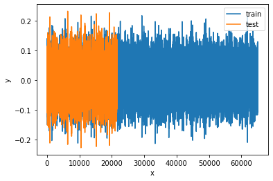
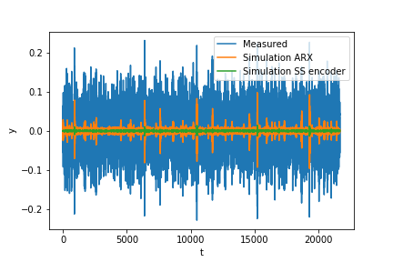

# deepSI
 
Dynamical System Identification using python incorporating numerous powerful deep learning methods. (deepSI = deep System Identification)

## Goals of deepSI

The goal of deepSI is to provide a platform for the development and use of (deep) dynamical system identification methods. 
Furthermore, the deepSI module (i.e. toolbox) is implemented such that anyone can use it without requiring deep expert knowledge in either system identification or machine learning. 
Lastly, the usage of deepSI is intuitive and often requiring effectively no more than 10 lines of code as seen in the example below. 

## Documentation and Installation

The deepSI Documentation and Installation details are available at [deepsi.readthedocs.io/en/latest](https://deepsi.readthedocs.io/en/latest/). 

## Illustrative Example

```python
import deepSI
from matplotlib import pyplot as plt
train, test = deepSI.datasets.Silverbox() # Automaticly downloaded (and cashed) the Silverbox system data
                                          # It also splitted the data into two instances of System_data
plt.plot(train.y) #train.y = measured outputs (and train.u = the system inputs)
plt.plot(test.y)
plt.ylabel('y'); plt.xlabel('t'); plt.legend(['train','test']); plt.show()
```



```python
#ARX model
sys_SS_linear = deepSI.fit_systems.Sklearn_io_linear(na=2, nb=5) 
sys_SS_linear.fit(train) #fit the ARX data 
test_simulation_SS_linear = sys_SS_linear.apply_experiment(test)

#Encoder method with neural networks (Beintema, et al. 2020a)
sys_encoder = deepSI.fit_systems.SS_encoder(nx=4, na=10, nb=10) 
#batch optimization using PyTorch for back propagation. 
sys_encoder.fit(train, epochs=50, batch_size=256, loss_kwargs={'nf':50}, sim_val=test[:5000]) 
test_simulation_encoder = sys_encoder.apply_experiment(test)

#plotting the residuals
plt.plot(test.y)
plt.plot(test.y-test_simulation_SS_linear.y)
plt.plot(test.y-test_simulation_encoder.y)
plt.ylabel('y'); plt.xlabel('t'); 
plt.legend(['Measured','Simulation ARX', 'Simulation SS encoder'])
plt.show()
```



## Main Features

* Numerous System Identification methods
    * Linear methods (e.g. ARX, Linear State Space)
    * Nonlinear methods (e.g. NARX, GP, SVM, Sub-space Encoder)
    * User defined identification methods 
* Direct access to most popular system identification datasets and benchmarks (e.g. [nonlinearbenchmarks.org](http://www.nonlinearbenchmark.org/) and [DaISy](https://homes.esat.kuleuven.be/~tokka/daisydata.html))
* Numerous evaluation and analysis tools (e.g. RMS, NRMS, n-step NRMS)
* Numerous predefined data generation systems (e.g. openAI gym, Wiener, Lorenz attractor, video output systems)
* Being able to accommodate user defined data generation system with ease.

## Featured Projects utilizing deepSI

Gerben Beintema, Roland Toth, Maarten Schoukens; Nonlinear State-Space Identification using Deep Encoder Networks; Submitted to l4dc 2021a; [Github Repository](https://github.com/GerbenBeintema/SS-encoder-WH-Silver), [Arxiv](https://arxiv.org/abs/2012.07721)

Gerben Beintema, Roland Toth, Maarten Schoukens; Nonlinear State-space Model Identification from Video Data using Deep Encoders; Submitted to SYSID 2021b; [Github repository](https://github.com/GerbenBeintema/SS-encoder-video), [Arxiv](https://arxiv.org/abs/2012.07721)

## Contributing

deepSI is in ongoing development and anyone can contribute to any part of module.


## Contact

Feel free to contact me directly for any question or issues related to deepSI.

Main developer: PhD candidate Gerben Beintema at the TU/e. Control Systems. g.i.beintema@tue.nl

## License

BSD 3-Clause License