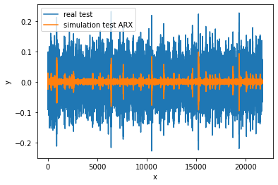

.. _tutorial:

Tutorial
========

This tutorial assumes knowledge of the Python programming language, as well as
familiarity with the third party modules Numpy and Matplotlib.

A little bit of theory
----------------------

The main focus is on discrete time systems of the form 

.. math::

   x_{t+1} = f(x_{t}, u_{t})

   y_t = h(x_t)

where :math:`x_t` is a internal state, :math:`u_t` the input applied on the system, :math:`y_t` the system output and :math:`f,h` the state and output functions. This can be extended to include problems with noise. These discrete time systems which hence generates system data in the form 

.. math::

   D = \{(u_t,y_t)| t=1,...,N_{\text{samples}}\}

Hence, the main problem deepSI aims to address is given systems data :math:`D` what is an accurate estimate of :math:`f,h`?

Quick start
-----------

In this example we will fit the well known Silverbox included with deepSI. We first load the system data into our dataframe called :meth:`deepSI.system_data.System_data`.

.. code-block:: python
   :emphasize-lines: 3,5

   import deepSI
   from matplotlib import pyplot as plt
   train, test = deepSI.datasets.Silverbox() # automaticly downloaded (and cashed) the system data
                                             # It also splitted the systems into two instances of System_data
   plt.plot(train.y)
   plt.plot(test.y)
   plt.ylabel('y'); plt.xlabel('x'); plt.legend(['train','test'])
   plt.show()

.. image:: images/silverboxfigure.png
   :scale: 100 %
   :alt: alternate text
   :align: center

Next we can choose from countless fittable systems. For instance we can use a ARX method like :meth:`deepSI.fit_systems.Sklearn_io_linear` which utilizes sklearn linear regression. 

.. code-block:: python
   :emphasize-lines: 3,5

   sys_SS_linear = deepSI.fit_systems.Sklearn_io_linear(na=2,nb=5)
   sys_SS_linear.fit(train)

To use this system we can use :meth:`deepSI.systems.System.apply_experiment` method which return a :meth:`deepSI.system_data.System_data` dataframe. The measure of fitness generally used is the NRMS :meth:`deepSI.system_data.System_data.NRMS`.

.. code-block:: python
   :emphasize-lines: 3,5

   test_simulation_SS_linear = sys_SS_linear.apply_experiment(test)
   train_simulation_SS_linear = sys_SS_linear.apply_experiment(train)
   print(test_simulation_SS_linear.NRMS(test)) # 0.12984812533409787
   print(train_simulation_SS_linear.NRMS(train)) # 0.13541408740489072
   plt.plot(test.y)
   plt.plot(test.y-test_simulation_SS_linear.y)
   plt.ylabel('y'); plt.xlabel('x'); plt.legend(['real test','simulation test ARX'])
   plt.show()

residual plot of ARX

Or we can use a more advanced SI method such as the encoder method :meth:`deepSI.fit_systems.SS_encoder` which utilizes the deep learning library PyTorch. Moreover it also utilizes batch optimization with the Adam optimizer. (see :meth:`deepSI.fit_systems.System_torch.fit` for details)

.. code-block:: python
   :emphasize-lines: 3,5

   sys_encoder = deepSI.fit_systems.SS_encoder(nx=4, na=10, nb=10)
   sys_encoder.fit(train, epochs=50, batch_size=256, loss_kwargs={'nf':50}, sim_val=test[:5000])
   test_simulation_encoder = sys_encoder.apply_experiment(test)
   train_simulation_encoder = sys_encoder.apply_experiment(train)
   print(train_simulation_encoder.NRMS(train)) # 0.013109197256339526
   print(test_simulation_encoder.NRMS(test)) # 0.01563269225510009

Which is quite a substantial improvement even without complete convergence of the optimization.

.. code-block:: python
   :emphasize-lines: 3,5

   plt.plot(test.y)
   plt.plot(test.y-test_simulation_SS_linear.y)
   plt.plot(test.y-test_simulation_encoder.y)
   plt.ylabel('y'); plt.xlabel('x'); plt.legend(['real test','simulation test ARX', 'simulation test encoder'])
   plt.show()

.. image:: images/silverbox_arx_encoder.png
   :scale: 100 %
   :alt: alternate text
   :align: center

To save the resulted encoder system we can simply call

.. code-block:: python
   :emphasize-lines: 3,5

   sys_encoder.save_system('encoder-silverbox') # saves a pickle of the systems.
   # sys_encoder = deepSI.load_system('encoder-silverbox') # load system

This concludes a basic use case of deepSI.

Quick tips
----------

You can create your own system data by calling

.. code-block:: python
   :emphasize-lines: 3,5

   sys_data = deepSI.System_data(u=[1,2,3,4,5],y=[1,1,2,3,5])

There is a build in quick plot method in :meth:`deepSI.system_data.System_data.plot` which will automaticly set the axis labels.

.. code-block:: python
   :emphasize-lines: 3,5

   sys_data.plot()

All fit_systems have as default a input and output normalization operation see :meth:`deepSI.system_data.System_data_norm` and setting the sys.use_norm flag to false will disable this feature. (can be glitchy if constant values are present)

Sometimes you have multiple independent time series, one can combine these series by using :meth:`deepSI.system_data.System_data_list`

.. code-block:: python
   :emphasize-lines: 3,5

   sys_data_list = deepSI.system_data.System_data_list([sys_data1,sys_data2])

This can than be directly used to fit systems (SS_linear is an exception).

For hyper-parameter tuning one can use the build in functions of :meth:`deepSI.fit_systems.random_search` and :meth:`deepSI.fit_systems.grid_search`.

Making your own systems
-----------------------

For this you will need to have a grasp of the basics of python classes and Inheritance. These two concepts are the basis of deepSI and makes it relatively easy to expand. 

Example tutorial: https://www.w3schools.com/python/python_inheritance.asp

Afterwards take a look at the inheritance chains present (e.i. start with :meth:`deepSI.fit_systems.SS_encoder` and work your way up)

